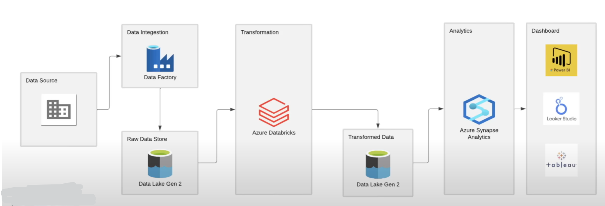
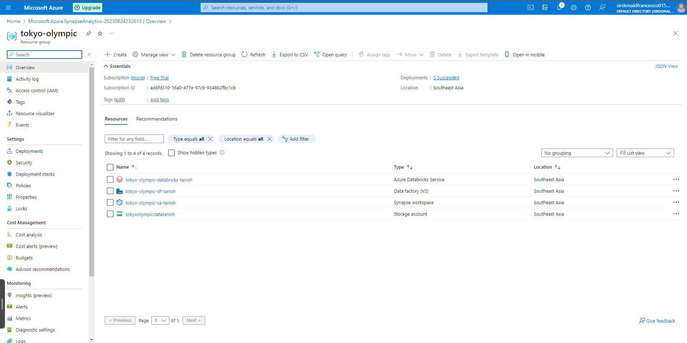
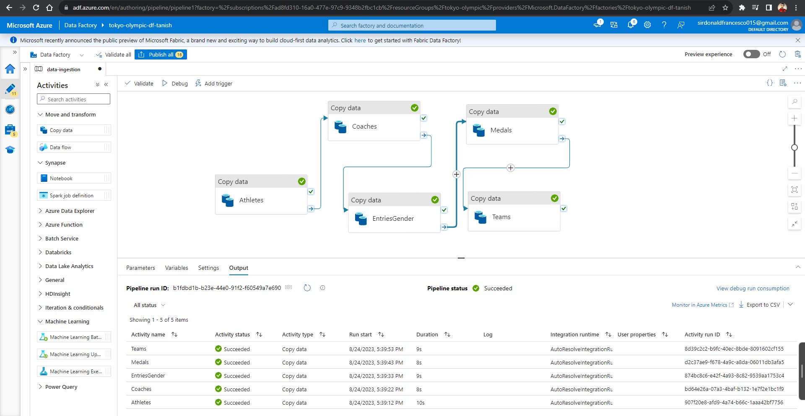
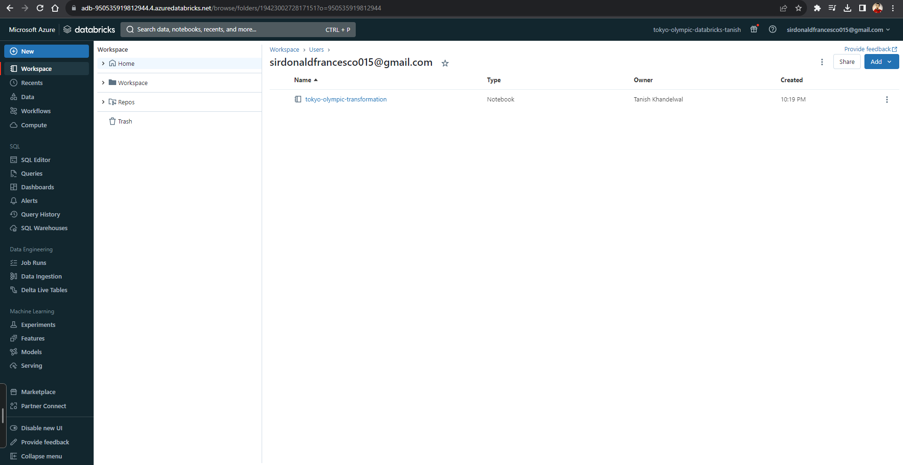

# olympic-data-analysis-azure

The **Tokyo Olympic Data Analysis on Azure** project is a comprehensive solution for analyzing and visualizing Olympic Games data using various Azure services. This project aims to showcase how to leverage the power of cloud computing and Azure's data services to gain insights from historical Olympic data. By combining Azure Databricks, Azure Data Factory, and other Azure resources, this project provides a scalable and efficient way to process, transform, and analyze large volumes of Olympic data.

## Table of Contents
- [Introduction](#introduction)
- [Architecture](#architecture)
- [Technologies Used](#technologies-used)
- [Getting Started](#getting-started)
  - [Prerequisites](#prerequisites)
- [Data Ingestion](#data-ingestion)
- [Data Processing](#data-processing)
- [Conclusion](#conclusion)

## Introduction

The Olympic Data Analysis on Azure project demonstrates how to build an end-to-end data analysis pipeline on the Azure cloud platform. This involves ingesting raw Olympic data, transforming it into a suitable format, performing analysis, and creating insightful visualizations. The project provides an example of how to integrate and utilize Azure Databricks, Azure Data Factory, and other Azure services to achieve these goals.

## Architecture

The architecture of the project consists of the following components:

- **Azure Databricks**: Used for data processing, transformation, and analysis. It provides a collaborative and interactive environment for running Spark-based jobs.

- **Azure Data Factory**: Manages and orchestrates the data workflow. It is responsible for data ingestion from various sources, data transformation, and scheduling of jobs.

- **Azure Storage**: Serves as the data lake for storing raw and processed data. It can also host intermediate results generated during the analysis.

- **Azure SQL Database**: Stores the cleaned and transformed data, making it accessible for visualization and reporting.

- **Power BI**: Connects to the Azure SQL Database to create interactive and visually appealing dashboards for data exploration.

## Technologies Used

- Azure Databricks
- Azure Data Factory
- Azure Storage
- Azure SQL Database
- Azure Synapse Analytics

## Getting Started

### Prerequisites

- Azure subscription
- Azure Databricks workspace
- Azure Data Factory instance

## Data Ingestion

## Data Processing

The data processing stage involves cleaning and transforming raw Olympic data into a structured format suitable for analysis. This step takes advantage of Azure Databricks' distributed computing capabilities for efficient processing.

## Conclusion

The Olympic Data Analysis on Azure project demonstrates how to leverage Azure services for processing, analyzing, and visualizing large-scale data. By following the setup and guides provided in this repository, you can adapt the project to other domains and expand its functionalities. Happy analyzing!

## Author
[@tknishh](https://github.com/tknishh)
